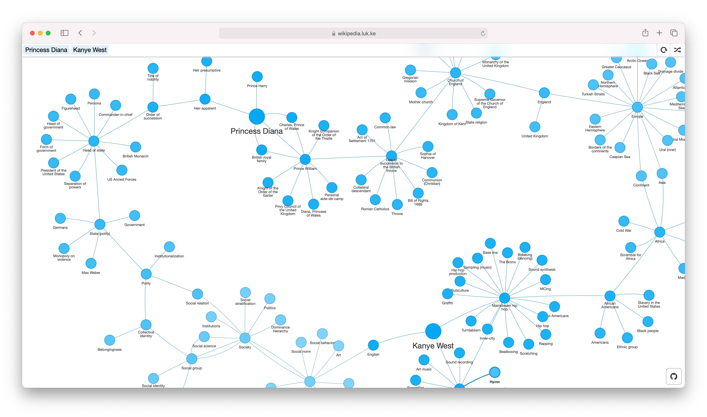
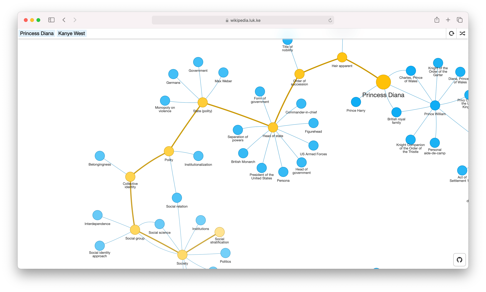

<h1 align="center">Wikipedia Map</h1>
<p align="center">A web app for visualizing the connections between Wikipedia pages. Try it at <a href="https://wikipedia.luk.ke/">wikipedia.luk.ke</a>.</p>




## Usage
Start by entering a topic into the text box, for example *Cats*. A single “node” will be generated, labeled *Cat*, which appears as a circle on the graph. Click this node to expand it.

Expanding a node creates a **new node for each Wikipedia article linked in the first paragraph of the article you clicked**. These new nodes will be connected to the node from which they were expanded. For example, expanding *Cat* will create eight nodes, including *Fur*, *Mammal*, *Carnivore*, and *Domestication*, each of which will be connected to *Cat*. These new nodes can also be expanded in the same way. By continuing to expand nodes, you can build a complex web of related topics.

You can also enter multiple articles to "compare" by pressing Comma, Tab, or Enter after each one you enter.


## Cloning
To use the app locally, simply
```bash
git clone https://github.com/controversial/wikipedia-map/
```
and open `index.html` in a web browser. No compilation or server is necessary to run the front-end.


## Design choices

#### Functional
Expanding a node creates nodes for each article linked in the _first paragraph_ of the article for the node you expand. I've chosen to use links only from the first paragraph of an article for 2 reasons:

1. There is usually a manageable number of these links, about 5-10 per page.
2. These links tend to be more directly relevant to the article than links further down in the page.

#### Visual
Nodes are lighter in color when they are farther away from the central node. If it took 5 steps to reach *Ancient Greek* from *Penguin*, it will be a lighter color than a node like *Birding*, which only took 2 steps to reach. Thus, a node's color indicates how closely an article is related to the central topic.

Hovering the mouse over a node will highlight the path back to the central node:

This is not necessarily the shortest path back; it is the path that you took to reach the node.


## How it works

#### API
When you click to expand a node, a request is made to the Wikipedia API to download the full content of the Wikipedia article corresponding to that node. Wikipedia map uses this data to find the links in the first paragraph of the article.

#### HTML Parsing
`wikipedia_parse.js` uses the [`DOMParser` API](https://developer.mozilla.org/en-US/docs/Web/API/DOMParser) to parse wikipedia pages’ HTML (retrieved from calls to Wikipedia's API). The parser looks for the `<p>` tag corresponding to the first paragraph of the article, then extracts all of the `<a>` tag links within this paragraph. It then filters the links to include only those which link to other wikipedia articles.

You can see this in action yourself in your browser’s console. If you have Wikipedia Map open, open your browser’s developer tools and type `await getSubPages('Cat')`. After a second, you should see an array with the names of other related articles.

#### The graph
The front-end uses [`vis.js`](https://visjs.org/) to display the graph. Every time a node is clicked, the app makes a `XMLHttpRequest` to the Node.js server. The resulting links are added as new nodes, colored according to their distance from the central node (as described above).

## Roadmap

### Stuff I'd like to implement soon(ish)

#### Interface
- [x] Build a GUI
  - [x] Change input method to something other than prompt
  - [x] Allow starting anew without refreshing page
  - [x] Create small info button that explains the project, controls, etc.
    - [x] Render this README into the help dialog
    - [x] The area with the network should contain instructions when it is blank
    - [x] Create a more thorough help dialog explaining controls, etc. which also includes the README
  - [x] Add a "Random Article" button
  - [x] Create a *better* help menu that pops up when a user first visits.
  - [ ] Make the tour better
    - [ ] Show users how to expand and trace back nodes. To do this, create a floating invisible div over a start node. Then, pin the Shepherd step to this div.
    - [ ] Don't allow users to advance to the next step until they've followed the instruction (entering articles, pressing Go)
    - [x] Disappear the info box when the tour is started
- [x] Allow inputting of multiple starts
  - [x] Build an interface for this
- [ ] Implement saving + sharing
  - [x] Saving a graph
  - [x] Loading a graph from an id
  - [x] Loading a graph from a URL parameter
  - [ ] Implement sharing UI

#### Interaction
- [x] Hovering over a node will show a traceback of how you arrived at that node, kind of like breadcrumbs
- [x] mobile optimization: Implement a separate set of controls for touch devices
- [x] On both desktop and mobile, double-click (or tap) a node to open the corresponding wikipedia page in a new tab
- [ ] Improve efficiency of highlighting the nodes


#### Technical
- [x] `.gitignore`-ify the libraries directory, no reason for it to be in here when I didn't write that stuff
- [x] Remove dependance on some external libraries:
	- [x] jQuery
	- [x] wordwrap
	- [x] tinycolor
- [x] Move JavaScript to separate files from HTML
- [x] Make API requests asynchronous
- [ ] Add some kind of build system to make building local copies and contributing easier

### Stuff it might be nice to implement sometime in the far future
- [ ] Autocomplete names of Wikipedia articles in the top bar
- [ ] Make the size of nodes reflect the number of backlinks
- [ ] Support for other languages
- [ ] Support for other MediaWiki wikis


## Credits
This project is powered by Wikipedia, whose wealth of information makes this project possible.

The presentation of the graph is powered by [`vis.js`](https://visjs.org).
